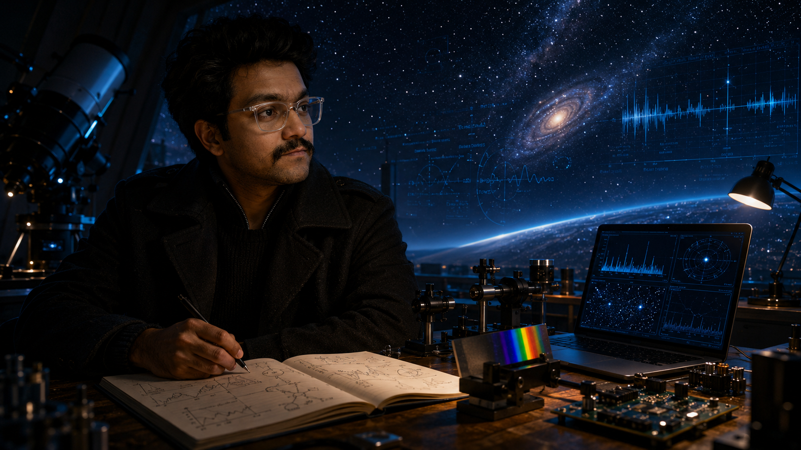

# Biswajit Jana — Academic Portfolio Website

<p align="center">
  
</p>

This repository hosts my personal academic portfolio and scientific writing website.

**Website:**  
https://biswajit1999.github.io/Biswajit_Jana.github.io/

---

## About Me

I am an astrophysics graduate with a background in Electronics and Communication Engineering. My academic and research interests sit at the boundary between astrophysics, optical instrumentation, electronics, feedback control, data analysis, and scientific computing.

My current research direction focuses on **EXOhSPEC**, the **Exoplanet High-Resolution Spectrograph**, where I work on spectrograph stabilisation, environmental response, optical path behaviour, detector-plane stability, and feedback-controlled experimental systems.

This website brings together my research profile, projects, publications, technical interests, scientific writing, and interactive astrophysics explainers.

---

## Website Sections

The website currently includes:

- **Home** — academic profile, research overview, and selected highlights  
- **Research** — current research direction and instrumentation work  
- **Projects** — selected astrophysics, optics, electronics, and engineering projects  
- **Publications** — journal publications, conference proceedings, talks, and posters  
- **Paper Notes** — structured notes from research papers and technical reading  
- **Blog** — scientific essays, concept explainers, and interactive visual articles  
- **Archive** — posters, seminars, visual material, and research communication outputs  
- **CV** — academic CV and downloadable PDF  
- **Interactive Tools** — browser-based visual simulations and scientific calculators  

---

## Research Interests

My main research interests include:

- Exoplanet instrumentation  
- Extreme-precision radial velocity spectroscopy  
- High-resolution spectrographs  
- Optical systems and laboratory instrumentation  
- Environmental effects on precision optical measurements  
- Feedback control for scientific instruments  
- Adaptive optics and detector-plane stability  
- Brown dwarfs and observational astrophysics  
- Exoplanet atmospheres and spectroscopy  
- Scientific computing, modelling, and data analysis  

---

## Featured Research: EXOhSPEC

EXOhSPEC stands for **Exoplanet High-Resolution Spectrograph**.

My work on EXOhSPEC explores how environmental effects, optical behaviour, and feedback strategies influence the stability of a precision spectrograph platform. The project involves:

- Thermal control and monitoring  
- Optical path length behaviour  
- Environmental sensing and analysis  
- Detector-plane / pixel stability  
- Adaptive optics and temperature-feedback strategies  
- Feedback logic and control-system design  
- Python-based experimental data analysis  
- Scientific plotting, reporting, and research communication  

This work is ongoing and is presented as an evolving instrumentation research programme.

---

## Selected Projects

Some of the projects represented on this website include:

- EXOhSPEC feedback control and spectrograph stability  
- Optical path length modelling and environmental-response analysis  
- Halo T dwarf candidate research using astronomical survey data  
- Satellite laser ranging detector-performance study  
- Visible light communication system using Raspberry Pi  
- Radio interferometry summer-school project  
- Scientific computing and experimental data analysis  
- Interactive physics and astrophysics tools developed for learning and outreach  

---

## Blog and Scientific Writing

A growing part of this website is the **Blog** section, where I write personal but scientifically grounded posts on astrophysics, cosmology, instrumentation, and scientific ideas that interest me.

The blog is written in an academic but accessible style. Some posts are long-form essays, while others include interactive simulations, scientific diagrams, calculators, and visual explainers.

Current and ongoing blog themes include:

- control systems and PID control  
- instrumentation and scientific problem-solving  
- radial velocity and Doppler spectroscopy  
- black holes and general relativity  
- pulsars and compact objects  
- spectra, light, and astronomical measurement  
- cosmology, the Big Bang, and the observable universe  
- astrobiology, biosignatures, technosignatures, and the question of life elsewhere  
- visually supported educational posts with custom scientific illustrations  

The aim of the blog is not only to explain science, but also to communicate how I think about scientific questions as an astrophysics researcher with an instrumentation background.

---

## Interactive Scientific Articles

Some blog posts are designed as interactive “visual lab” articles. These may include:

- browser-based JavaScript simulations  
- canvas-based scientific visualisations  
- Three.js/WebGL experiments  
- parameter sliders and live readouts  
- MathJax-rendered equations  
- glossary and telemetry sidebars  
- embedded comment sections using GitHub Discussions  

These interactive posts are intended for education, outreach, and scientific communication. They are not replacements for peer-reviewed research or numerical production simulations.

---

## Paper Notes

The **Paper Notes** section is a structured reading space where I document research papers, methods, and technical ideas relevant to my long-term interests.

This includes notes on:

- radial velocity instrumentation  
- spectrograph stability  
- brown dwarfs  
- exoplanet detection methods  
- optical systems  
- control systems  
- experimental and observational techniques  

These notes are intended as a long-term research-learning archive.

---

## Publications and Outputs

The publications page includes selected journal and conference outputs from my academic background, including work in visible light communication, smart systems, and reversible logic / QCA.

Future updates may include links to:

- posters  
- talks  
- research summaries  
- GitHub repositories  
- scientific plots and analysis outputs  
- conference and seminar material  

---

## Visuals and Conceptual Illustrations

Selected visuals on this website are **original science-informed conceptual illustrations created for this portfolio**.

They are used as artistic, educational, and explanatory visuals only. They should not be interpreted as observational astronomy images, measured scientific data, or exact diagrams of real instruments unless explicitly stated.

Some blog posts and project pages also include custom diagrams and visual frames created to support scientific communication and make technical concepts more accessible.

---

## SEO and Indexing

The repository includes technical files to support search engine indexing through GitHub Pages:

- `sitemap.xml` — sitemap for key website pages and blog posts  
- `robots.txt` — crawler instructions for search engines  
- `.nojekyll` — ensures GitHub Pages serves folders and files correctly  
- OpenGraph and Twitter metadata for selected pages  
- JSON-LD structured data for improved search visibility  

The website is intended to be indexable by Google and shareable on platforms such as LinkedIn.

---

## Comments and Interaction

Some blog posts include comment sections powered by GitHub Discussions through **giscus**.

This allows readers to leave comments, reactions, questions, or corrections directly on scientific blog posts.

---

## Built With

This website is built using:

- HTML  
- CSS  
- JavaScript  
- GitHub Pages  
- MathJax for equations  
- Canvas and Three.js for selected interactive visualisations  
- Giscus for comments on selected posts  

The site is intentionally kept lightweight, editable, and easy to expand without requiring a heavy external framework.

---
## Purpose of This Repository

This repository functions as both:

1. a personal academic portfolio website, and  
2. a growing archive of my research communication, technical interests, scientific writing, and interactive educational tools.

It brings together my background in astrophysics, instrumentation, electronics, coding, and scientific curiosity in one place.

---

## License / Reuse

© 2026 Biswajit Jana. All rights reserved.

Website text, design, research descriptions, blog content, code structure, and original conceptual visuals may not be reused, redistributed, or reproduced without appropriate credit.

If you would like to reference or reuse material from this website, please credit:

**Biswajit Jana**  
https://biswajit1999.github.io/Biswajit_Jana.github.io/

---

## Repository Structure

Typical structure:

```text
/
├── index.html
├── cv.html
├── publications.html
├── paper-notes.html
├── archive.html
├── sitemap.xml
├── robots.txt
├── .nojekyll
├── blog/
│   ├── index.html
│   ├── blog-data.json
│   ├── posts/
│   │   ├── black-hole-extreme-lab.html
│   │   ├── radial-velocity-method.html
│   │   ├── control-system.html
│   │   ├── pid-control.html
│   │   ├── big-bang-part-1.html
│   │   ├── are-we-alone.html
│   │   ├── are-we-alone-part-2.html
│   │   └── spectra-confession.html
│   └── tools/
│       └── black-hole-simulator.html
├── images/
└── files/

## Research Quality Upgrade

See [RESEARCH_QUALITY.md](RESEARCH_QUALITY.md) for the validation layer, reference anchors, equations and research boundaries added to this repository.
